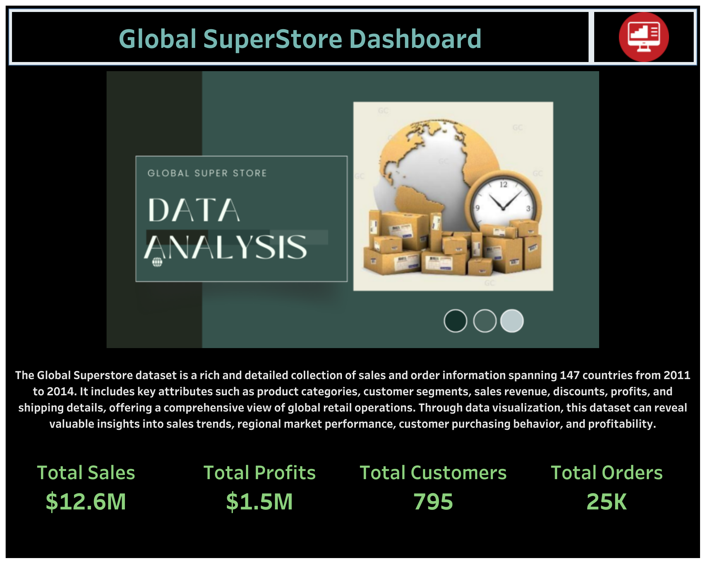

#  Global Superstore Dataset Cleaning and Visualization Project

This project demonstrates a full data analysis, from **data cleaning** using **Python** and **SQL** to creating a **visualization dashboard** using **Tableau**. The data is cleaned, preprocessed, and analyzed to create insightful visualizations and reports for effective decision-making.

## Table of Contents
1. [Project Overview](#project-overview)
2. [Technologies Used](#technologies-used)
3. [Data Cleaning with Python](#data-cleaning-with-python)
4. [Data Cleaning with SQL](#data-cleaning-with-sql)
5. [Creating a Dashboard with Tableau](#creating-a-dashboard-with-tableau)
---

## Project Overview

This project is focused on cleaning and visualizing data to help uncover trends, correlations, and insights from large datasets. The data comes from kaggle  Global Superstore Dataset, and the workflow includes:

- **Data cleaning and preprocessing** using **Python (Pandas)**.
- **SQL queries** for further data transformation and aggregation.
- **Tableau** to build interactive dashboards.

---

## Technologies Used
- **Python**: For data cleaning and transformation (using Pandas)
- **SQL**: For data extraction, transformation, and loading (ETL process).
- **Tableau**: For building interactive dashboards and visualizations.
- **Jupyter Notebooks**: For documenting the data cleaning process.
- **GitHub**: For version control and collaboration.

---

## Data Cleaning with Python

### Steps involved in cleaning the data using Python:
1. **Loading Data**: I start by loading raw data into a Pandas DataFrame.
2. **Handling Missing Values**: I Checked for missing or `NaN` values to be removed.
3. **Date and Time Conversion**: `Order_Date` and `Ship_Date` are converted to `datetime` types.
4. **Data Transformation**: Column names with the dot are replaced with underscores
5. **Handling Duplicates**: Checked for duplicates and dropped any duplicated rows.
6. **Feature Engineering**: Remove unnecessary columns.
7. **Saving Cleaned Data**: Save the cleaned dataset for further analysis or upload to SQL.

Example code for loading the data, changing the datatype and saving the cleaned File:
```python
import pandas as pd

#Load the raw data
data = pd.read_csv('Global_superstore.csv')
data.head()

data.info()

data['Order_Date'] = pd.to_datetime(data['Order_Date'])
data['Ship_Date'] = pd.to_datetime(data['Ship_Date'])

# Save the cleaned data
data.to_csv('cleaned_data.csv', index=False)
```
---

## Data Cleaning with SQL

### Overview
This project focuses on cleaning, transforming, and normalizing the SuperSell dataset using Google BigQuery. The dataset contains information related to customers, orders, shipments, locations, and Products. The cleaning process ensures data consistency, removes duplicates, and structures the dataset into well-defined tables for better analysis and performance.

### Steps involved in cleaning the data using SQL:
1. **Feature Engineering**:
   - Created `LOCATION_ID` by concatenating `COUNTRY`, `REGION`, and `CITY`.
   - Generated `SHIP_ID` using the first three letters of `Ship_Mode` and `ROW_ID`.
2. **Handling Missing Values**: Checked for and ensured no missing values in key fields (`Customer_ID`, `Product_ID`, `Location_ID`, `Ship_ID`).
3. **Fixing Data Inconsistencies**:
   - Converted `CUSTOMER_NAME`, `CATEGORY`, `CITY`, `REGION`, and `COUNTRY` to uppercase.
   - Corrected negative values in `SALES`, `QUANTITY`, and `SHIPPING_COST`.
4. **Normalization**: Created separate tables for `ORDERS`, `CUSTOMERS`, `PRODUCTS`, `LOCATION`, and `SHIPMENT`.

Example SQL Query for Fixing Negative Values:
```sql
UPDATE platinum-goods-452923-t1.SuperSell.Cleaned_data
SET SALES = ABS(SALES),
    SHIPPING_COST = ABS(SHIPPING_COST),
    QUANTITY = ABS(QUANTITY)
WHERE SALES < 0 OR SHIPPING_COST < 0 OR QUANTITY < 0;
```
## Creating a Dashboard with Tableau

### Overview
The cleaned data was then used to build an interactive dashboard in Tableau. The dashboard presents key insights into sales, customer demographics, order trends, and product performance.

### Tableau Dashboard:
Here’s a screenshot of the interactive Tableau dashboard created for this project:

You can also explore the live dashboard by following this [link to the Tableau Dashboard](https://public.tableau.com/app/profile/yonatan.firde/viz/GlobalSuperStoreVisualization_17414888442700/MainDASHBOARD).




